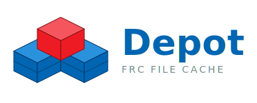

<p align="center">
  
</p>

# Depot

Depot is an FRC event **file cache** — a local download hub. It pre-caches
large files (FRC software, game manuals, vendor libraries, etc.) onto a box so
teams can grab them over the venue network without internet, much like the CSA
USB Tool but always-on and self-serve.

## What it does

- Caches files listed in `files.json` (added by URL, uploaded, or bulk-loaded
  from Jamie Sinn's CSA-USB-Tool season list, which Depot auto-tags by vendor).
- Serves a public page where teams browse (grouped/sorted/searchable by tag),
  download cached files, or trigger an on-demand "Cache & Download".
- Provides a Cache Management page (open) and a password-lockable System page.
- Exports the whole cache to a folder (e.g. a mounted USB stick).

Runs on any machine — there is no hardware dependency.

## Project layout

```
depot/
  depot/               Python package
    app.py             Flask application factory
    __main__.py        entry point: python -m depot
    config.py          defaults + config.toml + DEPOT_* env vars
    state.py           thread-safe shared runtime state
    storage.py         files.json, tags, system id, disk + size helpers
    cache.py           downloader + background cache sync worker
    monitor.py         internet monitor + git update checker
    services.py        wires everything together; starts workers
    web/               public + admin Flask blueprints (+ optional auth)
  templates/           Jinja templates (base + pages)
  static/              CSS + logos (all self-hosted; no CDNs)
  tests/               pytest suite
  config.example.toml  copy to config.toml to override settings
  launcher.sh          git pull + start, run by systemd
```

## Configuration

All settings have built-in defaults. To override, copy `config.example.toml` to
`config.toml` and edit it, or set `DEPOT_*` environment variables (env wins over
the file). Common knobs:

| Setting | Default | Notes |
|---|---|---|
| `[server] port` | `80` | HTTP port |
| `[admin] password` | *(unset)* | Blank = System page open; set to require login |
| `[cache] verify_ssl` | `false` | Many FRC mirrors have broken certs |

## Development

Run it on a laptop:

```bash
python -m venv .venv
.venv/bin/pip install -r requirements.txt
DEPOT_PORT=8080 .venv/bin/python -m depot
# open http://localhost:8080
```

Run the tests:

```bash
.venv/bin/pip install pytest
.venv/bin/python -m pytest
```

## Install on the Raspberry Pi

These steps use `YOUR_USER` as a placeholder — replace it with your actual Pi
username (e.g. `pi`, `wifipi`, whatever you set in Raspberry Pi Imager).

 1. Log in (via SSH or keyboard + monitor).

 2. Install dependencies and clone:
    ```bash
    sudo apt-get update && sudo apt install -y git python3-venv
    cd ~
    git clone https://github.com/JamesCerar/depot.git
    cd depot
    ```

    > If you get a permission denied error on the next steps, the folder was
    > likely cloned as root. Fix it with:
    > ```bash
    > sudo chown -R YOUR_USER:YOUR_USER ~/depot
    > ```

 3. Set up the Python environment:
    ```bash
    python3 -m venv .venv
    source .venv/bin/activate
    pip install --upgrade pip
    pip install -r requirements.txt
    deactivate
    chmod +x launcher.sh
    ```

 4. (Optional) set an admin password:
    ```bash
    cp config.example.toml config.toml
    nano config.toml   # uncomment and set [admin] password
    ```

 5. Create the service — replace `YOUR_USER` with your username:
    ```bash
    sudo nano /etc/systemd/system/depot.service
    ```
    ```ini
    [Unit]
    Description=Depot file cache
    After=network.target

    [Service]
    User=root
    Group=root
    WorkingDirectory=/home/YOUR_USER/depot
    ExecStart=/bin/bash /home/YOUR_USER/depot/launcher.sh
    Restart=always
    RestartSec=5

    [Install]
    WantedBy=multi-user.target
    ```

 6. Enable and start:
    ```bash
    sudo systemctl enable depot.service
    sudo systemctl start depot.service
    sudo chown -R YOUR_USER:YOUR_USER ~/depot
    ```

### Optional: set a friendly hostname

By default the Pi is reachable at `http://raspberrypi.local`. To use
`http://depot.local` instead:

```bash
sudo raspi-config
```

Go to **System Options → Hostname**, set it to `depot`, then reboot. Any device
on the same network can now reach Depot at `http://depot.local` — no DNS setup
required.
